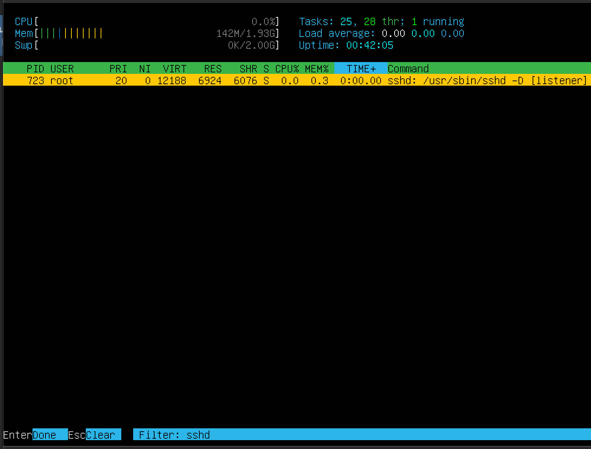
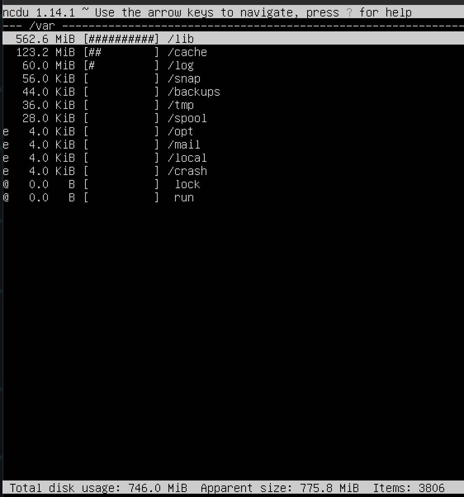
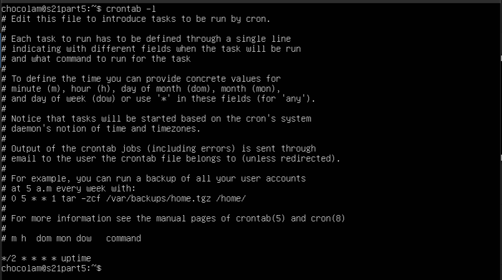

## Part 1

- Проверка версии Ubuntu

## Part 2
Команда для создания пользователя:
`useradd -m -G adm violetta`

- `useradd` - команда для создания нового пользователя
- `-m` - опция создания домашнего каталога для нового пользователя
- `-G adm` - опция для добавления нового пользователя в группу adm
- `violetta` - имя нового пользователя

Выводим новыого пользователя с помощью команды 
`cat /etc/passwd | grep violetta`:

## Part 3

1. Установить имя машины: `sudo hostnamectl set-hostname user-1`

2. Установить временную зону: `sudo timedatectl set-timezone Europe/Moscow`

3. Вывела названия сетевых интерфейсов при помощи команды `ip a`:

- интерфейс lo (loopback) - виртуальный интерфейс, присутствующий по умолчанию в любом Linux.который используется для обратной связи внутри компьютера. Этот интерфейс представляет собой логический интерфейс, который позволяет отправлять сетевой трафик на компьютер и принимать его оттуда же без физического соединения с другими устройствами в сети. Интерфейс lo обычно имеет IP-адрес 127.0.0.1, который называется «localhost», и он является уникальным для каждого сетевого устройства. Это позволяет программам и службам на компьютере взаимодействовать друг с другом через сетевой стек, используя API сети без необходимости отправлять данные через физическую сеть.
- Интерфейс lo часто используется для работы с сетевыми сервисами, тестирования сетевых приложений, отладки и других методов взаимодействия программ на уровне сети без реального сетевого соединения. Также интерфейс lo играет важную роль в обеспечении надежности и безопасности работы сетевых приложений и сервисов на компьютере.

4. `sudo apt install net-tools` - предложил установить для выведения ip
- вывожу информацию о сетевых интерфейсах при помощи команды `ifconfig`
- вывела Ip-адрес: `10.0.2.15` (команда: `hostname -I`)

- DHCP - протокол динамической настройки узлов (Dynamic Host Configuration Protocol). DHCP - это стандартный сетевой протокол, который позволяет сетевым устройствам автоматически получать IP-адреса и другие сетевые настройки от специального DHCP сервера в сети. DHCP упрощает процесс настройки сети, поскольку устройства могут быть автоматически настроены на получение IP-адреса, шлюза по умолчанию, DNS-серверов и других параметров сети без необходимости ручной настройки на каждом устройстве.

5. Внешний ip-адрес шлюза (ip): `cur1 ipinto.io/ip`

    Внутренний IP-адрес шлюза: `ip route | grep default`

6. Изменила файл /etc/netplan/*.yaml, применили изменения в netplan, перезагрузились:
- `/etc/netplan`
- `sudo nano 00-installer-config.yaml`

Убедилась, что статичные сетевые настройки (ip, gw, dns) соответствуют заданным в предыдущем пункте:

7. Успешно пропинговала удаленные хосты 1.1.1.1 и ya.ru:

## Part 4

Обновила системные пакеты:

## Part 5

sudo - позволяет временно поднимать привилегии и выполнять задачи администрирования системы с максимальными правами
su <name> - переключение на пользователя

Добавила пользователя `s21_part5` в группу с привилегиями sudo, переключились на этого пользователя и поменяли hostname:

## Part 6

Настроила службу автоматической синхронизации времени, вывела время часового пояса, в котором я сейчас нахожусь:

## Part 7

### VIM

1. Для сохранения и выхода нажала `ESC` и прописала `:wq`:

2. Для выхода без сохранения `ESC` -> `:q!` -> `ENTER`:

3. Для поиска: `/pattern`:

4. Для замены: `:s/pattern1/pattern2`:

### NANO

1. Для сохранения: `^O`, подтвердила, вышла через `^X`:

2. Для выхода без сохранения `^X` -> `N`:

3. Для поиска: `^W` -> `pattern`:

4. Для замены: `^\` -> `pattern1` -> `pattern2` -> `Y`:

### JOE

1. Для сохранения и выхода: ^KX + подтвердить:

2. Для выхода без сохранения: `^C` -> `y`:

3. Для поиска: `^K F` -> `pattern` -> `I`:

4. Для замены: `^K F` -> `pattern1` -> `R` -> `pattern2` -> `Y`:

## Part 8

#### 1. Установила пакет openssh-server, который содержит службу SSHd, с помощью команды:
`sudo apt install openssh-server`

#### 2. Проверила ее статус с помощью команды:
`sudo systemctl status ssh`

#### 3. Настройка автоматического запуска при загрузке системы:
`sudo systemctl enable ssh`

#### 4. Перезапуск системы
`sudo reboot`

#### 5. Снова проверила ее статус:
`sudo systemctl status ssh`

#### 6. Открыла файл:
`sudo nano /etc/ssh/sshd_config`

#### 7. Изменила `Port 22` на `Port 2022`:

#### 8. Перезапустила службу sshd чтобы изменения вступили в силу:
`sudo systemctl restart ssh`

`ps` - выводит сведения о процессах в статическом виде
`-e` - позволяет выбрать все процессы
`| grep sshd` - поиск по выводу через пайп

#### 9. Проверила, что служба SSHd работает на новом порту:

#### 10. tan:
- -a - показывает состояние всех сокетов (обычно сокеты, используемые серверными процессами, не показываются)
- -n - показывает сетевые адреса числами (netstat обычно показывает адреса как символы)
- -t - отображает TCP подключения
- Proto - содержит тип протокола
- Recv-Q - счётчик байтов не скопированных программой пользователя из этого сокета
- Send-Q - счётчик байтов, не подтверждённых удалённым узлом
- Local Address - адрес и номер порта локального конца сокета
- Foreign Address - адрес и номер порта удалённого конца сокета
- State - состояние сокета
- LISTEN - сокет ожидает входящих подключений
- SYN_SENT - сокет, находящийся в режиме активной попытки установки подключения
- 0.0.0.0 - немаршрутиризируемый адрес IPv4, используется как адрес по умолчанию или адрес-заполнитель

## Part 9

### top:

1. uptime - это информация о времени работы системы, сколько времени система находится в рабочем состоянии `(10 min)`
2. количество авторизованных пользователей - отображает количество пользователей, находящихся в системе `(1 user)`
3. общая загрузка системы - показывает общую загрузку процессора, включая загрузку и ожидающие процессы `(0.00, 0.08, 0.11)`
4. общее количество процессов - указывает на общее количество процессов, работающих в системе `(Tasks: 94 total)`
5. загрузка CPU - показывает текущую загрузку процессора по ядрам `(%Cpu(s): 0.0 us, 0.0 sy, 0.0 ni, 100.0 id, 0.0 ws, 0.0 hi, 0.0 si, 0.0 st)`
6. загрузка памяти - отображает информацию о использовании оперативной памяти системой `(MiB Mem: 1971.6 total, 1456.9 free, 140.9 uswd, 373.8 buff/cache)`
7. pid процесса занимающего больше всего памяти - показывает идентификатор процесса, который использует наибольшее количество памяти. `(top -o RES)` - сортирует вывод по занимаемой памяти в порядке убывания, больше всего места занимает PID 673 
8. pid процесса, занимающего больше всего процессорного времени - выводит идентификатор процесса, который занимает больше всего процессорного времени. `(top -o TIME+)` - сортирует вывод по времени в порядке убывания, больше всего занимает PID 387

### htop:

##### PID:

##### PERCENT_CPU:

##### PERCENT_MEM:

##### TIME:

##### отфильтрованный для процесса sshd:

##### с процессом syslog, найденным, используя поиск:

##### с добавленным выводом hostname, clock и uptime:

## Part 10

#### Disk /dev/mapper/ubuntu--vg-ubuntu--lv:
#### 11.21 GiB, 12343836672 bytes
#### 24109056 sectors

## Part 11

#### командa df:

- размер раздела: `11758760`
- размер занятого пространства: `4796100`
- размер свободного пространства: `6343552`
- процент использования: `44%`
- единица измерения в выводе: `KiB`

#### командa df -Th:

- размер раздела: `12G`
- размер занятого пространства: `4.6G`
- размер свободного пространства: `6.1G`
- процент использования: `44%`
- тип файловой системы для раздела: `ext4`

## Part 12

`du` - оценка места на диске, занимаемого файлом, `-h` - добавляет букву размера

- du:

- /home: 

- /var:

- /var/log:

- du -ha /var/log/* (`du` - оценка места на диске, занимаемого файлом, `-h` - добавляет букву размера, `-a` - показывать размеры для всех встретившихся файлов, а не только для каталогов):

## Part 13

- /home: 

- /var:

- /var/log:

## Part 14

- время последней успешной авторизации, имя пользователя и метод входа в систему:

- сообщения о рестарте службы:

## Part 15

- добавила в журнал строку, которая вызывает uptime каждые 2 минуты (`crontab -e`):

- строчки о выполнении в системных журналах:

- список текущих заданий для CRON (`crontab -l`):

- удалила все задания из планировщика(`crontab -r`) и вывела список текущих заданий:
